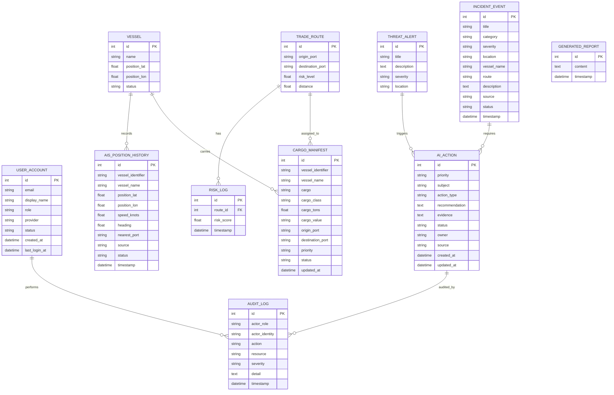
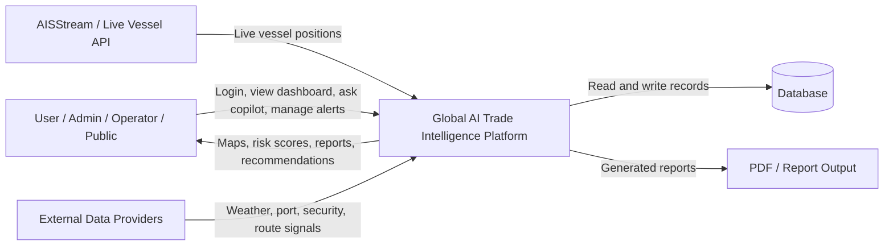
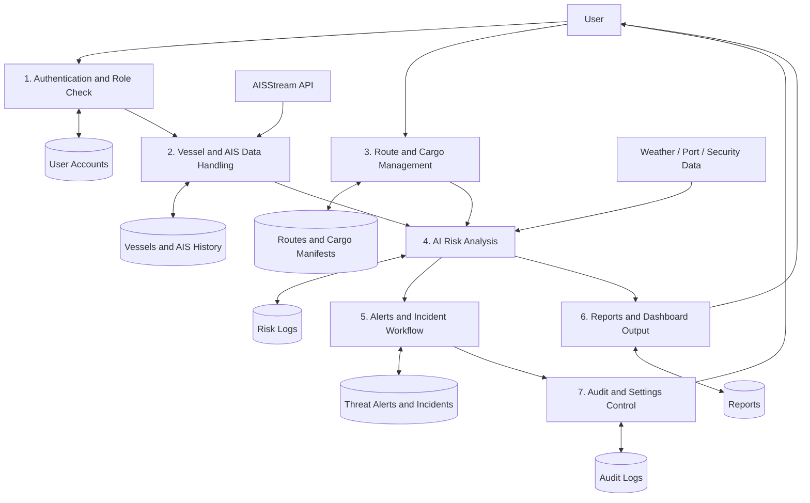
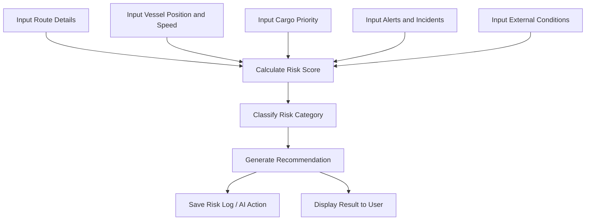

# Design Diagrams

Project Title: Global AI Trade Intelligence Platform

This page contains submission-ready ER and DFD diagrams for the project. If drawing by hand, use the simplified versions and explain the points below each diagram.

## ER Diagram



### ER Diagram Explanation

- `UserAccount` stores login details, role, provider, and account status.
- `Vessel` stores the main ship information and latest position.
- `TradeRoute` stores origin, destination, distance, and route risk.
- `RiskLog` stores historical risk scores for a route.
- `ThreatAlert` stores warnings such as piracy, storm, war, port delay, and cyber risk.
- `AISPositionHistory` stores vessel movement history from AIS or fallback data.
- `CargoManifest` stores cargo details linked to vessels and routes.
- `AIAction` stores AI-generated recommendations, approvals, and action status.
- `IncidentEvent` stores operational events or crisis records.
- `GeneratedReport` stores report content and timestamp.
- `AuditLog` stores important user/admin/operator actions for accountability.

## DFD Level 0 - Context Diagram



### Level 0 Explanation

The user interacts with the platform through the Streamlit frontend. The system collects data from the database, live AIS provider, and external risk sources. FastAPI processes the request, AI/risk logic generates output, and the result is shown as maps, dashboards, alerts, recommendations, and reports.

## DFD Level 1 - Main Process Flow



### Level 1 Explanation

1. User logs in as Admin, Operator, or Public.
2. The system verifies role permissions.
3. Vessel data is loaded from AISStream or local fallback records.
4. Route and cargo data are loaded from the database.
5. AI risk engine combines vessel, route, cargo, alert, and external signals.
6. The platform creates risk scores, route suggestions, alerts, and action plans.
7. Results are displayed in dashboards, maps, reports, and the AI Copilot.
8. Sensitive actions are stored in audit logs.

## DFD Level 2 - AI Risk Analysis Process



### Level 2 Explanation

The AI risk process takes route, vessel, cargo, alert, incident, and external condition data. It calculates a risk score, identifies the risk category, generates a suggested action, saves important records, and displays the decision to the user.

## Simple Hand-Drawn Version

If you have to draw quickly in the exam, draw these:

### Simple ER

```text
UserAccount -> AuditLog
TradeRoute -> RiskLog
TradeRoute -> CargoManifest
Vessel -> AISPositionHistory
Vessel -> CargoManifest
ThreatAlert -> AIAction
IncidentEvent -> AIAction
AIAction -> AuditLog
GeneratedReport is stored separately for report history.
```

### Simple DFD

```text
User
  -> Streamlit Frontend
  -> FastAPI Backend
  -> Database + AIS API + AI Risk Engine
  -> Dashboard / Maps / Alerts / Reports / Copilot Answer
```

## Short Explanation For Invigilator

The ER diagram shows how the database is structured. The main entities are users, vessels, trade routes, risk logs, threat alerts, cargo manifests, AI actions, incidents, reports, and audit logs. Routes have many risk logs, vessels have AIS history and cargo manifests, and user actions are stored in audit logs.

The DFD shows how data moves through the system. The user uses the Streamlit frontend, the frontend calls FastAPI, the backend reads database and AIS/API data, the AI risk engine processes it, and the final output is displayed as dashboards, maps, alerts, route suggestions, reports, and AI Copilot answers.
